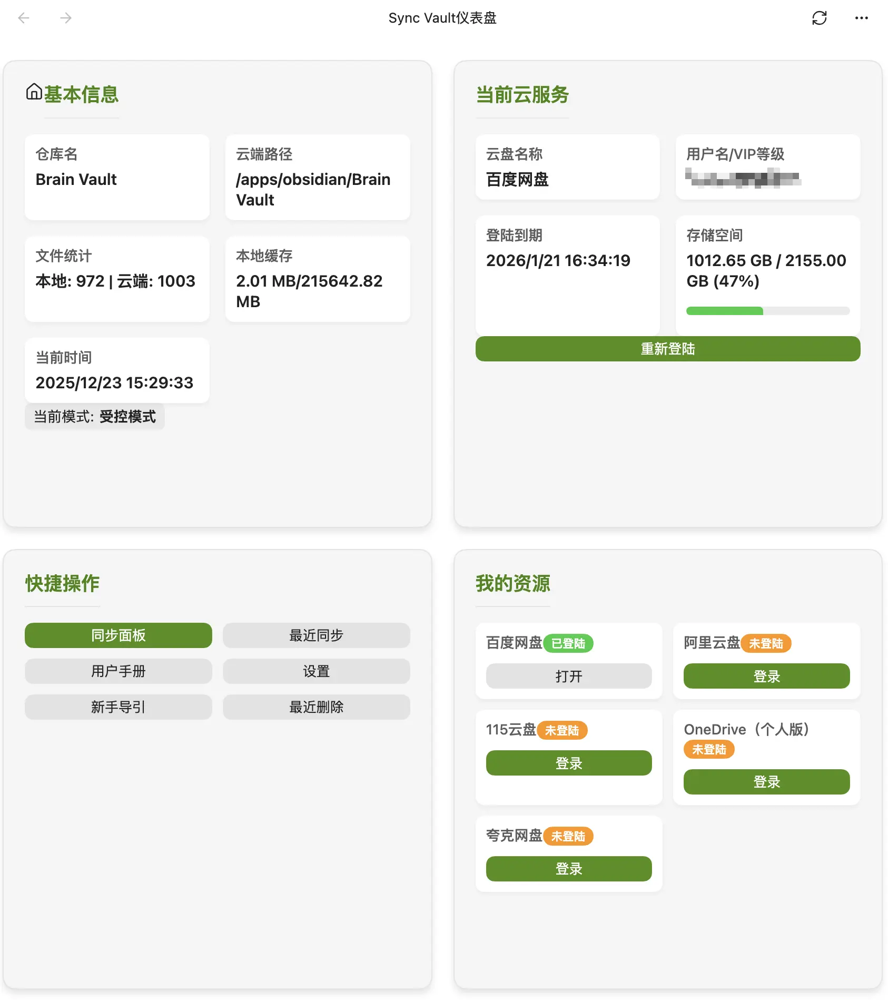

# 🌟 Sync Vault

一个跨平台多设备资源管理方案.

> [!note] 
> 从 1.0 版本开始闭源, 开源版本支持到 0.6.9

## ✨ 主要功能

- 多重备份, 轻松上传资料到多种网盘.
- 多设备同步, 支持通过7种云服务同步.
    - 支持双向同步和单向同步,自动识别文件删除&移动操作.
    - 内容冲突自动合并.
    - 文件删除可恢复.
    - 忽略大文件,按照正则表达式忽略对应名字文件.
    - 同步第三方插件和主题.
    - markdown文件端到端加密.
- 通过看板轻松访问云服务资源,比如PDF,音视频,在Obsidian中直接播放.

  

- 同一份文档多人协同编辑.

**实时协作演示**

[演示视频](https://github.com/user-attachments/assets/85d63239-2c5c-4d73-8774-f4ea2f93f426)

**百度网盘双向同步演示**

[演示视频](https://github.com/user-attachments/assets/fbc8c22a-9de2-42c4-b676-753007e5e031)

[点击查看](https://sync-vault.com)更多功能.

## 📱 支持的云服务种类

1. 百度网盘
2. 阿里云盘
3. OneDrive
4. 夸克网盘
5. 腾讯COS
6. 115云盘
7. WebDAV
    - 坚果云
    - InfiniCloud
    - 123云盘

## ⚙️ 安装和使用

### 从插件市场安装

插件市场搜索 `sync vault ce`,或[点击链接](https://obsidian.md/plugins?id=sync-vault-ce)快速安装.

### 开始使用

1. 点击侧边栏☁️图标,打开看板后,在快捷操作卡片找到新手引导按扭.
2. 点击**新手引导**按扭,按照提示完成网盘登陆和同步模式设置.

成功后,可看到Sync Vault看板.

## 🗺️ Roadmap

- 🌐 更多云服务
- 🏠 多人协同
- 🎨 更好的用户体验
- ⎔ 支持Zotero

## 🔗 Quick Links
- [📖 Documentation](https://kqiu.top/docs/)
- [💬 Discussions](https://github.com/abcamus/obsidian-sync-vault-ce/discussions)
- [🐛 Report Bug](https://github.com/abcamus/obsidian-sync-vault-ce/issues/new?template=bug_report.md)
- [✨ Request Feature](https://github.com/abcamus/obsidian-sync-vault-ce/issues/new?template=feature_request.md)

Special thanks to：

- [Obsidian](https://obsidian.md/)
- [React](https://react.dev/)
